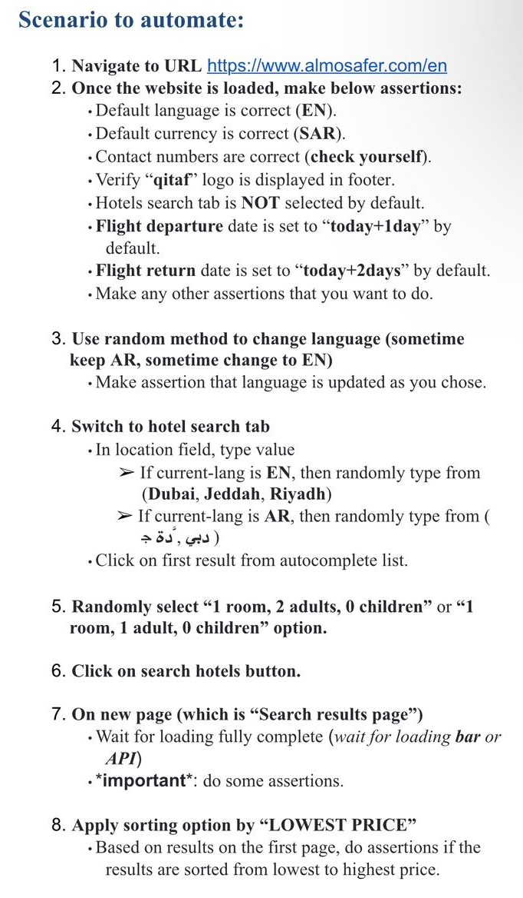

# Automated Testing for [Almosafer](https://www.almosafer.com/en)

This repository contains automated tests utilizing Selenium and TestNG frameworks in Java for the website above. All the test cases were conducted in Visual Studio Code.

## Technologies Used

- **Java**: Programming language used for writing the tests.
- **Selenium**: Framework for automating web applications for testing purposes, and for browser automation.
- **TestNG**: Testing framework inspired by JUnit and NUnit, designed for test configuration and management.

## Test Cases

The following image shows the test cases conducted:

